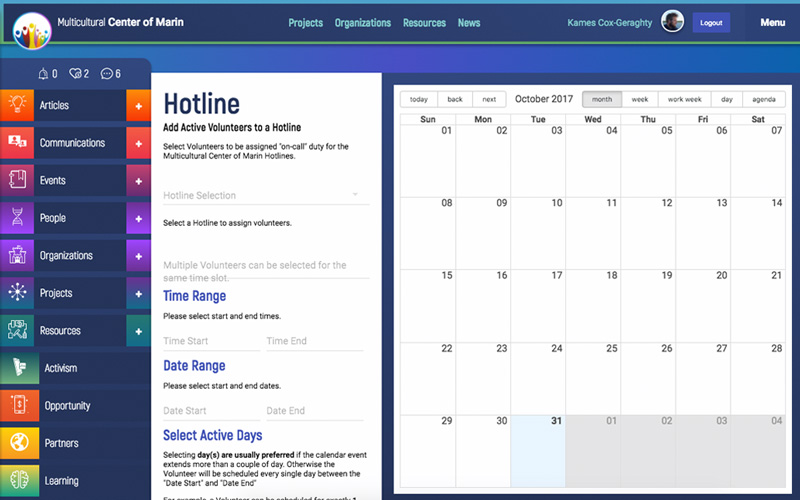
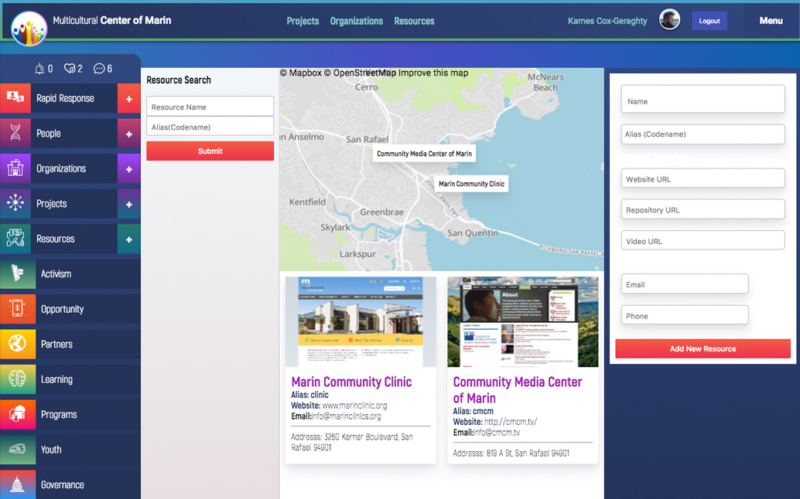

# Multicultural Center of Marin
### Open Source Grassroots Organizing Platform

```
git clone https://github.com/MulticulturalCenterMarin/ApplicationBrowser

cd ApplicationBrowser

npm install || yarn

npm run start || yarn start
npm run build || yarn build

```

The Multicultural Center of Marin Grassroots Organizing Platform is an Open Source"ish" Dashboard.


Built with React and Firebase, it's Open Source code (for the most part).

The primary intention is to help teams quickly launch a modern Online Application, without having to worry to much about the infrastructure.

In other words, the interface design, business logic and other technical solutions are launched under the formal G.T.D (Get Things Done) License, which requires you to get things done. The application (hopefully), with the right love, attention and nourishment will blossom into a beautiful, easy-to-use Online Application for Grassroots Organizing and Distributed Autonomous Organizations to launch exciting solutions, for the future, related to Blockchain technology, more specifically Ethereum.

### The What 
The project is currently in the "seedling" phase. Containing the essentials for launching a modern React (component based frontend) with an easy to manage authentication, database, storage and serverless functions infrastructure. It should be noted, the Synapsis project aims to reach full Open Source and potentially decentralized infrastructure. That being said, at the moment "rapid" prototyping and ease of use are the primary objective.



### The Why
The Application aims to solve the challenge of organizing, managing and facilitating a large distributed network of people. As we continue to face local/global challenges, the pressure to build robust community solutions will become even larger. However, managing people, especially a dectranlized distributed autonmous organization, is not a simple task.

*Organizing people at scale, requires understanding/observing the world at scale.*

Hence, the primary of objective of Multicultural Center of Marin is too relay the "state of the world (who, what, when, where and how)" as quickly as possible, to as many people as possible, using leading design techniques, vanguard code and shared cultural responsibility.



### The Who
The Multicultural Center of Marin (currently Canal Welcome Center) is birthing the Synapsis project to help empower a network of grassroots organizers, both locally and globally. Relationships are the foundation of life. The Marin CultureCenter is on a steadfast mission to connect the diverse communities, for sustained community well-being and happiness for everyone.

##### For The People. By The People.
Life, liberty and the pursuit of happiness. Granted to those who seek to unite and overcome today and tomorrow's growing challenges collectively. We have the power to solve challenges, both large and small, but first we have to unite communities, build relationships and create new models of self-empowerment.

**The project will be completed in stages. It's not currently anywehere near final form - level 9000**

In the future, the Multicultural Center of Marin repository will branch into a agnostic (as opposed to organization specific) boilerplate, so people and organizations can use the code without first having to delete the default content.

As of right now (stage 1), the primary objective is to refine the user experience, quickly prototype features via commercial platforms and discover the implementation patterns for emerging models provided by a decentralized technical infraustructure. Simply put, the power of blockchain, more specifically Ethereum, will be woven into the underyling technical fabric of user interaction.

**A family of Javascript applications will be built under a unified mission/codebase.**

- Browser (Progressive Web Application)
- Desktop (Electron)
- Smartphone (iOS/Android)
- Browser Extension (Brave/Firefox/Chrome)

To better manage computation intensive tasks, often associated with cryptography, WebAssembly will replace low-level operations wherever possible. In other words, the codebase will comprise mostly of Javascript to the extent it's feasible. But, to better accomodate future demands for user friendly secure, verifiable cryptographic implementations, C++/WebAssebmly will have a leading role in "technical stack" in future iterations.

# Staged Development/Production

## 1. The State of The World
Currently, the landscape for Internet technology is changing at a rapid pace. Javascript and Blockchain technologies are the 2 technologies poised for (continued) rapid ascention together. Therefore, to reach the highest number of people and with the most sharable solutions possible, the focus is to maintain interopability, understandability and adapatability of these 2 technologies.

- Online Application (Seedling)
- Desktop Application (Seed)
- Browser Extension (Seed)
- Smartphone (Seed)

As of now, the application Seed and Seedling repostiroies all use Firebase as an Authentication, Database and Storage system. Firebase was chosen as the initial "SaSS" provider, simply for the ability to quickly prototype and deploy applications. Longterm, the application will be moved to dectranalized, community owned servers, using Open Source to power the realtime database, encrypted authentications and distributed file storage systems.

The Primary Objectives for Stage 1 - The State of The World

- Design *literally the best* user interface/experience for a DAO (distributed autonmous organization)
- Develop standarized API's for Internet Applications and Dectranalized Blockchain infrastructure
- Draft the initial Social/Cultural mechanisms for facilitating short/long term interaction with a DAO (distributed autonmous organization)


# How It's Built
The Frontend is primary built with React, Redux and Redux Saga.

The Backend is primary built with Firebase (OAuth, NoSQL, JSON Data Structure, Serverless Functions)


## The Design System
Multiple design and developments philosphies/ideas are experimented and implemented within the Application, to achieve the mission  rapid, scalable user experience/interface prototyping for distrubted autonomous organizations functionality. The boilerplate is meant to be adaptaive, so overtime solutions will be added/pruned accomodate more cross-application composability.

1. Atomic Design Philosophy
2. Component/Container Seperation
3. Functional State Management  

### Components - Building Blocks
Components are the core building block of tht Frontend Interface. Incorporating the Atomic philosophy, components are categorized by significance, size and relevance within the Component hierarchy. Simply put, the similar to "the universe", which is built up of quarks, particles, atoms, molecules and organisms, so too is our Application. The components follow a simple hierarchy: quarks(css properties), atoms (links, input, svg, paragraphs), molecules (fields, slider, video) and organisms (tables, calendar, dialog), which for the most part allow for easier composition across a diverse range of interface/experience requirements.


##### Quarks ```(src/interface/components/particles/quarks)``` | Forked Styled System ```styled-system```
The Quarks folder is a fork of the Styled System Node Module.

CSS (cascading stylesheets) are primarily abstracted away using Javascript. Relying primarily on the design patterns used within ```styled-system``` to more rapidly design unique interface layouts using Javascript as the design orchestrator and CSS being the side-effect.

A major reason the ```styled-system``` module was forked, was simply to introduce shorthand abbreviations, so developers can minimize the amount of time spent writing property names. It's tedious and introduces "clutter" to the developer experience. 

In other words 'borderRadius' becomes 'br', 'boxShadow' becomes 'bs' and 'fontWeight' becomes 'fw'.

The second reason for forking the ```styled-system``` was to introduce more flexibility for controlling simple animations in future iterations.


##### Particles ```(src/interface/components/particles/particles)``` | Forked Rebass ```rebass```
The Particles module is a fork of the Rebass Node Module.

Rebass was forked, because the codebase introduces unneccesary code for our specific requirements. The repository (eventually) will be a slimmed version of Rebass, perhaps attempting to integrate with React Primitives to share a unified codebase with future React Native Applications.

The particles main objective is to provide the basic design building design blocks such as background color, shadows, border, with, height for the atomic components. The simple design API allows for easy design composition. Components can quickly add shadows, change their heights, and even add properties specific two new features such as flexbox and grid. This particular approach allows for a fluid and dynamic design approach. Allowing developers to quickly prototype new layouts using shorthand design patterns.

The components branch is comprised of the core react components. The atomic folder contains the basic building blocks, such as paragraphs, lists, images, links, containers, shapes. In addition it goes up and complexity with things such as fields public and private routes sliders and tables.


## Containers - Manage Data Flow 
Containers are primarily responsible for fetching and managing State with Redux. That being said, there may be a few instances where containers are responsible for interacting with different application mechanisms, besides just Redux. For example the Mining container  interacts with the coin hive application by loading the Javascript mining tool asynchronously, when a user requests the feature.

The primary Application containers are Firestore and Graph.

The Firestore containers interacts with the Firebase NoSQL database, using the redux-saga-firebase module package. Currently, a forked Branch is being used to experiment with the new firestore schema features. As the project progresses will merge our findings into the primary redux-saga Firebase module package. 

The Graph container interacts with the GraphQL API hosted on Firebase’s serverless Cloud Functions. The current implementation is very basic. Providing the simple ability to query lists of data with map, filter and reduce in conjunction with the limited real-time database query mechanisms. In fact the code is still a little messy, so excuse me ;)

The code is primarily remnants of when Firebase did not have a NoSQL database, as there were attempts to overcome the somewhat challenging limits of a simple JSON data tree using GraphQL. An integrated NoSQL database was critical.

In the future realtime communications, like secure chat, be rerouted through the application GraphQL query/resolver model, so the codebase fortunately does serve a purpose.

Important to note, is application information, which communicates with outside, third-party API and is also very time sensitive to user experience, will be held in the real-time database, as opposed to the Firestore NoSQL database. The real-time database has a quicker response time then the NoSQL database therefore, when communication infrastructure features, such as phone call monitoring and rerouting, it will be more advantageous to store application data in the more readily accessible JSON data structure,  to optimize user experience.

Because of this, it will be important to run the GraphQL server when using specific communications features, such as the Communication Hotline/Call Center features. It will allow users to easily query and double check the real-time database.


#Notes & Messy Ideas
A DAO is responsible for organizing the world's entities.

An entity is at the core of the data model. People, Organizations, Events, Tasks, Resources, Projects, Tools, Vehicles, and more are all entities.

A distributed autonomous organization 

Why do we need an interface for a distributed autonomous organization?

Distributed autonomous organization is a newly discovered concept arising from the emergence of blockchain technology, and specifically Turing complete blockchain technology. However, we are in the beginning stages of understanding how to Properly construct a distributed autonomous organization at scale. 

A distributed autonomous organization is a new  way of thinking.

It is difficult to conceptualise.

For most, the idea contradicts the current model’s operating rules.
